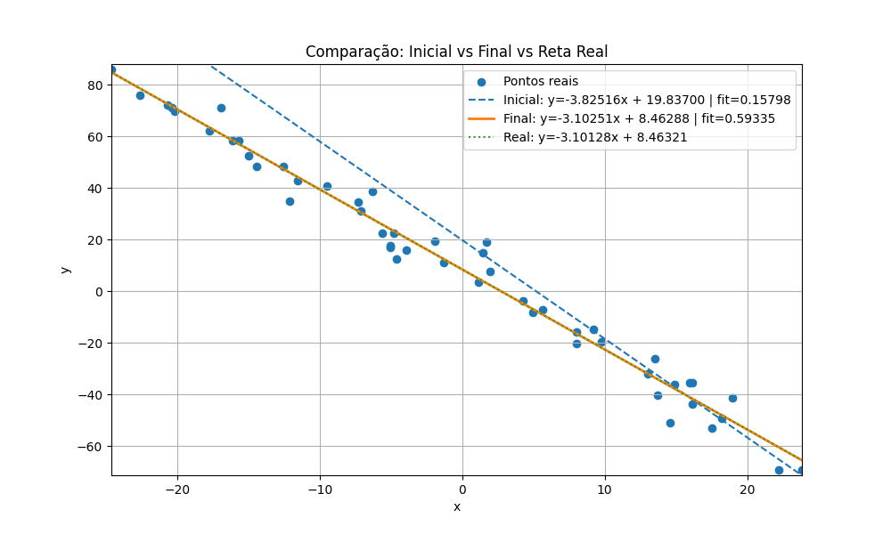
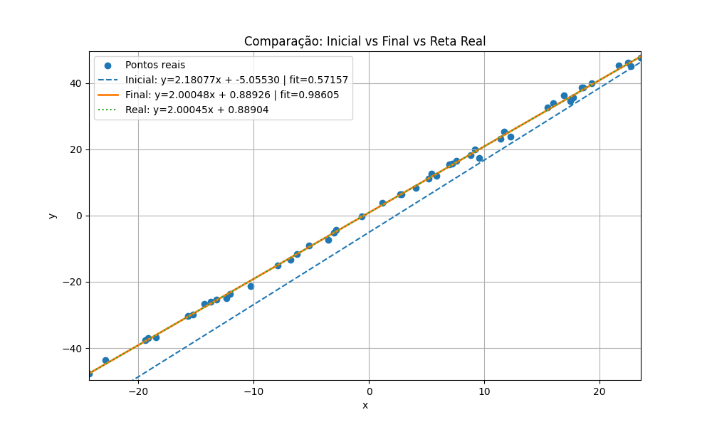
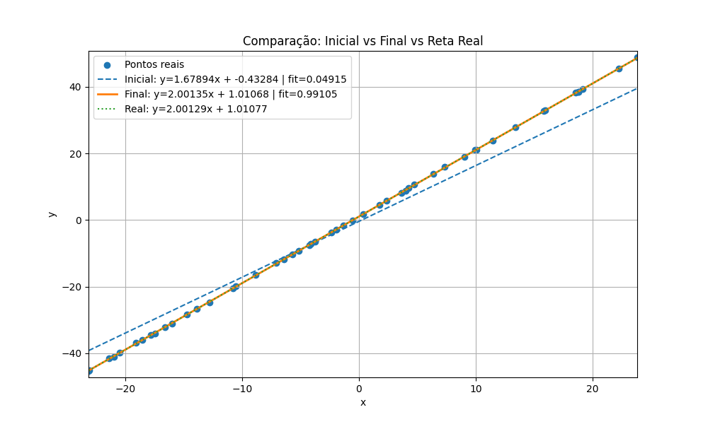

<div align="center">
  


</div>


<div align="center">

# Algoritmo Genético — Ajuste de Função Linear

**Trabalho Prático de Algoritmos e Estruturas de Dados**

Implementação de um Algoritmo Genético (AG) para encontrar a reta que melhor se ajusta a um conjunto de pontos.
</div>

---

## O que é um Algoritmo Genético?

Algoritmos Genéticos são metaheurísticas de busca e otimização inspiradas no processo de seleção natural descrito por Charles Darwin. A ideia central foi formalizada e analisada computacionalmente por John Holland na década de 1970, na Universidade de Michigan, sendo popularizada pelo livro *Adaptation in Natural and Artificial Systems* (1975). Desde então, os AGs têm sido amplamente utilizados na resolução de problemas de otimização em espaços de busca grandes, complexos ou mal definidos.

Seu funcionamento é análogo à evolução biológica: uma população de soluções candidatas evolui ao longo de gerações por meio de operadores genéticos como seleção, recombinação (crossover) e mutação. A avaliação das soluções é realizada por meio de uma função de aptidão, na qual indivíduos mais aptos possuem maior probabilidade de transmitir suas características para as gerações seguintes, guiando a busca em direção a regiões mais promissoras do espaço de soluções.

Neste projeto, cada indivíduo representa uma reta `y = ax + b`, onde os genes `a` (coeficiente angular) e `b` (coeficiente linear) são os parâmetros a serem otimizados. O objetivo é encontrar a reta que melhor se ajusta a um conjunto de pontos fornecidos como entrada.

---

## Estrutura do Projeto

```
.
├── data/
│   └── input.dat          # Arquivo de entrada com os pontos
├── images/                # Gráficos gerados pelo plot.py
│   ├── grafico_caso1.png
│   ├── grafico_caso2.png
│   └── grafico_caso3.png
├── include/
│   ├── fitness.hpp
│   ├── individuo.hpp
│   ├── operacoes.hpp
│   ├── populacao.hpp
│   └── read.hpp
├── src/
│   ├── fitness.cpp
│   ├── individuo.cpp
│   ├── main.cpp
│   ├── operacoes.cpp
│   ├── populacao.cpp
│   └── read.cpp
├── output.dat             # Saída gerada pelo AG
├── plot.py                # Visualização dos resultados
└── Makefile
```

---

## Funcionamento do Código

### Representação do Indivíduo

Cada indivíduo é uma struct com dois genes reais e um valor de fitness:

```cpp
struct Individuo {
    double a;        // coeficiente angular
    double b;        // coeficiente linear
    double Fitness;
};
```

### Inicialização da População (Geração 0)

Antes de gerar a população, o código calcula automaticamente os intervalos válidos para `a` e `b` com base nos dados de entrada, por meio da função `calcularIntervalos()`. Isso garante que os indivíduos iniciais nasçam em uma faixa de busca relevante, independentemente da escala dos dados.

Com esses limites definidos, `gerarPopulacao()` cria `m` indivíduos com valores aleatórios de `a` e `b` dentro desses intervalos. A Geração 0 é, portanto, inteiramente aleatória dentro de um espaço de busca bem delimitado.

Para garantir reprodutibilidade dos experimentos, o algoritmo utiliza uma semente fixa no gerador pseudoaleatório (`srand(42)`). Dessa forma, a mesma sequência de números aleatórios é gerada a cada execução, permitindo a replicação exata dos resultados obtidos.

### Função de Fitness

O fitness é calculado em `fitness.cpp` com base no Erro Quadrático Médio (MSE) entre a reta do indivíduo e os pontos reais:

```
MSE = (1/n) * Σ (a*xᵢ + b - yᵢ)²
Fitness = 1 / (1 + MSE)
```

O fitness varia entre 0 e 1. Quanto mais próximo de 1, melhor o ajuste da reta aos dados. Essa formulação penaliza erros grandes de forma quadrática e garante que o AG sempre busque minimizar o MSE.

### Seleção

A seleção é feita por **elitismo com corte**: a população é ordenada por fitness e apenas os melhores `cutRate = 40%` são elegíveis para reprodução. Um pai é escolhido aleatoriamente dentre essa elite, garantindo diversidade sem abrir mão de qualidade.

### Crossover

O crossover implementado é um **crossover uniforme de dois genes**: dado o pai 1 `(a₁, b₁)` e o pai 2 `(a₂, b₂)`, são gerados dois filhos por troca direta de genes:

```
Filho 1: (a₁, b₂)
Filho 2: (a₂, b₁)
```

Cada filho herda um gene de cada pai, garantindo que características boas de ambos os pais sejam combinadas.

### Mutação

Cada gene de um filho sofre mutação com probabilidade `mutationRate = 5%`. Quando ocorre, uma perturbação aleatória no intervalo `[-0.5, +0.5]` é somada ao gene:

```
se rand() < mutationRate:
    gene += rand(-0.5, 0.5)
```

A mutação introduz diversidade genética e evita que o AG fique preso em ótimos locais.

### Substituição

Após o crossover e a mutação, os filhos avaliados substituem os piores indivíduos da população atual (`SubsPior()`), preservando sempre as melhores soluções encontradas.

### Ciclo Evolutivo

```
Ler input.dat
    ↓
calcularIntervalos() → define limites de a e b
    ↓
gerarPopulacao() → Geração 0 (aleatória)
    ↓
Para cada geração:
    AvaliarPopulacao() → calcula fitness de cada indivíduo
    Ordenar por fitness
    Salvar melhor no output.dat (fitness, MSE, a, b)
    Para cada par de filhos:
        selecionarPais() → crossover() → mutacao()
        calcularFitness() dos filhos
        SubsPior() → substitui os piores
    ↓
Exibir melhor solução encontrada
```
## Opções de Desing do projeto
 
Algumas escolhas de implementação divergem da especificação proposta para o trabalho, visando melhorar a qualidade da busca evolutiva:
 
**Seleção restrita aos melhores** — a especificação sugere selecionar sempre os dois indivíduos com maior fitness. Entretanto o algoritmo utiliza uma seleção aleatória dentre o top 40% da população ordenada por fitness. Isso introduz diversidade genética na reprodução, evitando que o algoritmo convirja prematuramente para um ótimo local por sempre cruzar os mesmos dois indivíduos.
 
**Dois filhos por crossover** — a especificação ilustra a geração de um único filho `(a1, b2)`. Nesta implementação são gerados dois filhos por operação — `(a1, b2)` e `(a2, b1)` — aproveitando integralmente a troca de genes entre os pais e aumentando a diversidade da população a cada geração.
 
**Struct em vez de matriz m×2** — a especificação sugere representar a população como uma matriz de dimensão m×2 com um vetor auxiliar de fitness. Optou-se por encapsular `a`, `b` e `Fitness` em uma struct `Individuo`, agrupando os dados de cada indivíduo em uma única unidade lógica. Isso melhora a legibilidade, facilita a modularização e é funcionalmente equivalente à representação matricial.

---

## Entrada e Saída

### Formato de entrada — `data/input.dat`

```
n m G
x1 y1
x2 y2
...
xn yn
```

- `n`: número de pontos
- `m`: tamanho da população
- `G`: número de gerações

### Formato de saída — `output.dat`

Uma linha por geração com o melhor indivíduo daquela geração:

```
geracao fitness erro a b
0       0.31245 3.210 1.876 0.543
1       0.40123 2.490 1.932 0.821
...
```

- `fitness`: valor de `1 / (1 + MSE)` do melhor indivíduo
- `erro`: MSE do melhor indivíduo
- `a`, `b`: coeficientes da melhor reta encontrada

---

## Análise de Complexidade

A função `gerarPopulacao()` possui complexidade **O(m)**, onde `m` é o tamanho da população, pois percorre cada indivíduo uma única vez para inicializá-lo.

A função `AvaliarPopulacao()` tem complexidade **O(m · n)**, pois para cada um dos `m` indivíduos calcula o MSE sobre os `n` pontos de entrada.

A ordenação da população por fitness é feita com `std::sort`, cuja complexidade é **O(m log m)** no caso médio.

A seleção `selecionarPais()` é **O(m log m)** por chamada, pois ordena uma cópia da população. Como é chamada `m` vezes por geração (uma para cada filho), o custo total da seleção por geração é **O(m² log m)** — este é o gargalo do algoritmo.

A substituição `SubsPior()` percorre a população para encontrar o pior, resultando em **O(m)** por chamada.

O loop principal executa `G` gerações, portanto a complexidade total do algoritmo é **O(G · m² log m)**.

---

### Em tabela

| Função | Complexidade | Observação |
|---|---|---|
| `gerarPopulacao()` | O(m) | Inicialização linear |
| `calcularFitness()` | O(n) | MSE sobre n pontos |
| `AvaliarPopulacao()` | O(m · n) | Avalia toda a população |
| `std::sort` (ordenação) | O(m log m) | Chamado 1x por geração |
| `selecionarPais()` | O(m log m) | Ordena cópia da população |
| `crossover()` | O(1) | Troca direta de genes |
| `mutacao()` | O(1) | Perturbação por gene |
| `SubsPior()` | O(m) | Busca linear pelo pior |
| **Loop principal** | **O(G · m² log m)** | **Complexidade total** |

> `n` = número de pontos, `m` = tamanho da população, `G` = número de gerações.

---

## Comportamento do Erro ao Longo das Gerações
 
O comportamento do erro foi analisado em três cenários com diferentes níveis de ruído, todos com 50 pontos, população de 100 indivíduos e 300 gerações.
 
### Caso 1 — Ruído forte (σ = 6), reta `y = -3x + 7`
 
O AG partiu de um fitness inicial de `0.157` (MSE = 5.330) na geração 0 e convergiu rapidamente nas primeiras gerações. A queda mais expressiva ocorreu até a geração 50, onde o fitness já havia atingido `0.593` (MSE = 0.685). A partir daí o algoritmo estabilizou completamente, sem nenhuma melhora até a geração 299.
 
> **Resultado final:** `y = -3.10251x + 8.46288` · fitness `0.593352` · MSE `0.685339` · tempo `242 ms`
 
O desvio em `b` (8.46 vs 7.00 real) é esperado e representa o limite teórico imposto pelo ruído, a própria reta de melhor ajuste também não passa pelos pontos.
 
### Caso 2 — Ruído moderado (σ = 1), reta `y = 2x + 1`
 
Com ruído menor, a convergência foi muito mais rápida e expressiva. O fitness saiu de `0.571` na geração 0 para `0.938` já na geração 1 — um salto notável logo na primeira reprodução. Até a geração 11 o fitness já havia atingido `0.986`, estabilizando nesse patamar até o final.
 
> **Resultado final:** `y = 2.00048x + 0.889262` · fitness `0.986053` · MSE `0.014144` · tempo `245 ms`
 
O coeficiente angular `a = 2.00048` é virtualmente idêntico ao real. O pequeno desvio em `b` (0.889 vs 1.000) reflete o ruído residual dos dados.
 
### Caso 3 — Ruído mínimo (σ = 0.1), reta `y = 2x + 1`
 
Com dados quase perfeitos, o AG demonstrou sua capacidade máxima de convergência. A partir da geração 8 o fitness já superava `0.998`, e ao longo das gerações seguintes continuou refinando progressivamente até atingir `0.9998` (MSE = 0.000200) na geração 268, onde estabilizou.
 
> **Resultado final:** `y = 2.00406x + 0.969988` · fitness `0.9998` · MSE `0.000200504` · tempo `239 ms`
 
O refinamento foi contínuo e gradual até o final das 300 gerações, diferentemente dos casos anteriores onde a estabilização ocorreu bem antes.
 
### Conclusão
 
Em todos os casos, o padrão de convergência seguiu a mesma estrutura: queda abrupta do MSE nas primeiras gerações, seguida de refinamento progressivo até a estabilização. O nível de ruído dos dados determina diretamente o piso de erro alcançável, não sendo, em si, uma limitação do algoritmo, mas sim um limite teórico imposto pelos próprios dados. Nos três casos o tempo de execução ficou abaixo de 250 ms.

---

## Visualização

O script `plot.py` gera um gráfico comparando, os pontos de entrada vindos do `data/input.dat`, a reta inicial (melhor da geração 0), a reta final encontrada pelo AG, e a reta de referência calculada por mínimos quadrados exatos (`numpy.polyfit`):

## Visualização dos Resultados

### 📊 Caso 1 — Ruído forte (σ = 6)
<p align="center">
  
</p>

### 📊 Caso 2 — Ruído moderado (σ = 1)
<p align="center">
  
</p>

### 📊 Caso 3 — Ruído mínimo (σ = 0.1)
<p align="center">
  
</p>

##  Compilação, Execução e Visualização

A aplicação possui um `Makefile` que automatiza todo o processo de compilação e execução. Além disso, o script `plot.py` permite a visualização gráfica dos resultados gerados pelo algoritmo genético.

---

###  Comandos disponíveis

| Comando      | Função |
|-------------|--------|
| `make clean` | Remove arquivos gerados em compilações anteriores |
| `make`       | Compila o projeto utilizando o compilador `g++` |
| `make run`   | Executa o programa após a compilação |

---
###  Visualização dos Resultados (Python)

O script `plot.py` é responsável por gerar os gráficos a partir dos dados produzidos pelo algoritmo genético.

####  Pré-requisitos

Certifique-se de possuir o Python 3 instalado:


`python3 --version`

Caso não tenha, instale com:

`sudo apt update`

`sudo apt install python3 python3-pip`

Instale também as bibliotecas necessárias:

`pip3 install matplotlib numpy`

Após executar o algoritmo genetico, execute o comando abaixo para ver o gráfico produzido: 

`python3 plot.py`

<h2>Autores</h2>

<table>
  <tr>
    <td align="center">
      <br>
      <b>João Gabriel</b><br>
      
    </td>
  </tr>
</table>
